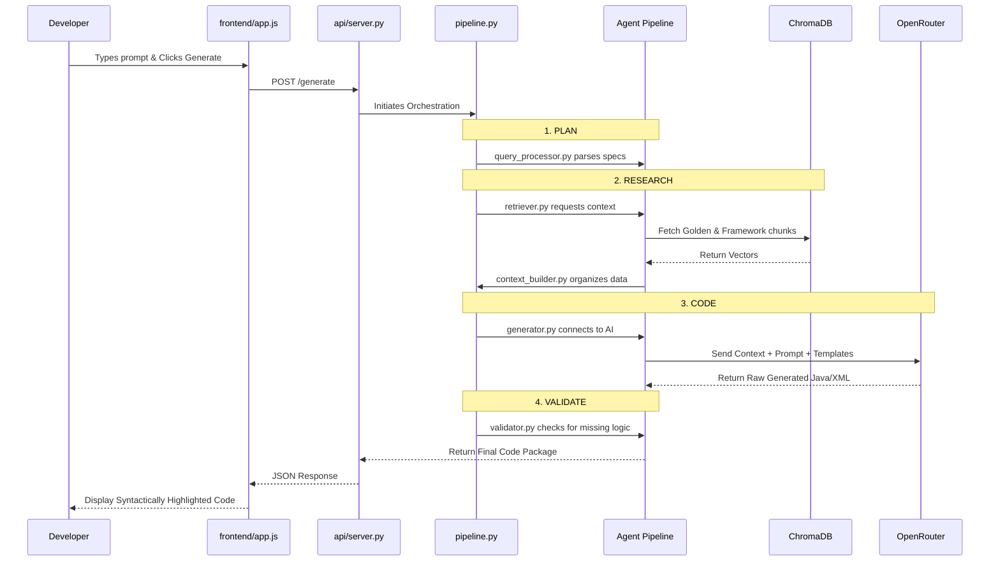

# Nova Connector Builder: Architecture & Execution Flow
*A deep-dive presentation guide for the end-to-end RAG pipeline.*

---

## 1. High-Level Overview
The Nova Connector Builder is an **Agentic RAG (Retrieval-Augmented Generation) Pipeline** designed to autonomously write complex Java integration connectors. It eliminates the need for engineers to manually write boilerplate code by utilizing OpenRouter/Gemini AI, backed by a localized ChromaDB vector database that strictly enforces the Saba Nova architectural framework.

> [!NOTE]
> This document explains the exact step-by-step journey of a single prompt—from the moment you start the server, to the moment the AI returns a fully functional, validated Java connector.

---

## 2. Phase 1: Startup & Initialization
The journey begins by spinning up the application.

### `api/server.py`
This is the heart of the application infrastructure. It is built using the **FastAPI** framework in Python. 
- **The Dual-Role Engine:** When you run `python3 api/server.py`, the backend starts up on `http://localhost:8000/`. However, it doesn't just listen for API calls; it also acts as a web server for the frontend. 
- **How it works:** Lines in `server.py` intercept any traffic going to the root URL (`/`) and explicitly serve the `index.html` file from the `frontend/` directory. This is why you don't need a separate Node.js server.
- **Lazy Loading:** It intelligently waits to load the heavy AI embedding models (`embeddings/embedder.py`) and the vector database connection until they are actually needed, keeping startup times instant.

---

## 3. Phase 2: The User Interface
Once the server is running, the user interacts with the frontend.

### `frontend/index.html` & `frontend/index.css`
These define the sleek, dark-mode user interface. It contains the prompt text box, the configuration toggles, and the code-editor display panels.

### `frontend/app.js`
This is the nervous system of the UI. When you type *"Build a Udemy connector"* and hit the "Generate" button, `app.js` takes over.
1. It gathers your prompt and any toggled settings.
2. It packages this data into a structured JSON payload.
3. It executes a `fetch()` command to send an HTTP POST request to the backend.

```javascript
// The exact bridge between UI and Backend in app.js
fetch('/generate', {
    method: 'POST',
    headers: { 'Content-Type': 'application/json' },
    body: JSON.stringify({ prompt: "Build a Udemy connector" })
})
```

---

## 4. Phase 3: The API Connection & Routing
The frontend request travels over your local network and hits the backend.

### `api/server.py` (The Routing layer)
The FastAPI server has a specific route defined as `@app.post("/generate")`. It catches the frontend's JSON payload, validates it using Pydantic schemas, and hands it off to the main execution pipeline.

### `pipeline.py` (The Orchestrator)
This script acts as the general manager for the entire AI generation process. It doesn't do the heavy lifting itself; instead, it coordinates the specialized tools inside the `agent/` folder in a strict, sequential order.

---

## 5. Phase 4: The Agentic Pipeline (The Core Brain)
This is where the magic happens. The `pipeline.py` calls upon specific, modular scripts located in the `agent/` directory. Each script acts as a specialized AI agent with a single responsibility.

### Step A: The Planner (`agent/query_processor.py`)
Before searching for data, the system needs to understand *what* it's building.
- **Action:** It parses your raw text prompt using regex and keyword matching.
- **Output:** It identifies that the connector is named "Udemy", the authentication is "Basic Auth", and the entity to sync is "Content Catalog".

### Step B: The Researcher (`agent/retriever.py` & `vectordb/store.py`)
The LLM cannot write Saba-compliant code from memory. It needs reference material.
- **Action:** `retriever.py` takes the specs from the planner and queries `store.py` (which manages the local ChromaDB database).
- **Retrieval:** It pulls ~4,000 chunks of knowledge. It specifically grabs "Golden References" (like how the `Kaltura` connector was built perfectly), the Nova framework markdown rules, and DML schema files.

### Step C: The Organizer (`agent/context_builder.py`)
- **Action:** The database returns messy, scattered chunks of code. `context_builder.py` formats these chunks cleanly, appending labels like `🏆 GOLDEN` to prioritize them, and truncates anything that exceeds the LLM's token limits to prevent crashes.

### Step D: The Coder (`agent/prompt_templates.py` & `agent/generator.py`)
This is the actual AI interaction.
- **Action:** `generator.py` bundles your original prompt, the organized database context, and strict system instructions from `prompt_templates.py`. 
- **Execution:** It opens an HTTP connection to OpenRouter (using `google/gemini-2.0-flash-001`) and streams the massive payload (often 12,000+ tokens).
- **Output:** The LLM responds with raw Markdown containing the newly written Java files (`ComponentControl.java`, `TestConnection.java`, etc.).

### Step E: The QA Reviewer (`agent/validator.py`)
We cannot trust AI blindly.
- **Action:** Before the backend sends the code to the frontend, `validator.py` scans the generated files. It ensures mandatory functions (like `testEdcast()` or pagination routers in `Content.js`) actually exist. If it fails, the system logs a `❌ FAIL` error to notify the developer.

---

## 6. Phase 5: Output & Application
### Returning to the UI
Once the QA validation is complete, `pipeline.py` hands the final code back to `api/server.py`. The backend responds to the original `fetch()` request from `frontend/app.js` with a massive JSON payload containing all the generated files. The UI updates instantly, displaying the syntax-highlighted code.

### `agent/repo_integrator.py` (The Deployment)
If you review the code in the UI and click **"Apply to Codebase"**:
1. The frontend hits the `/apply-to-repo` endpoint.
2. `repo_integrator.py` takes over. It locates your actual `sih_main` repository on your hard drive.
3. It creates the necessary folders in `/integration/apps/src/main/java/com/saba/integration/apps/...`
4. It patches the massive `VendorConstants.java` and `dml3.4.0.sql` files by injecting the new Udemy definitions exactly where they belong without breaking existing code.

---

## 7. Visual Execution Flow Diagram


