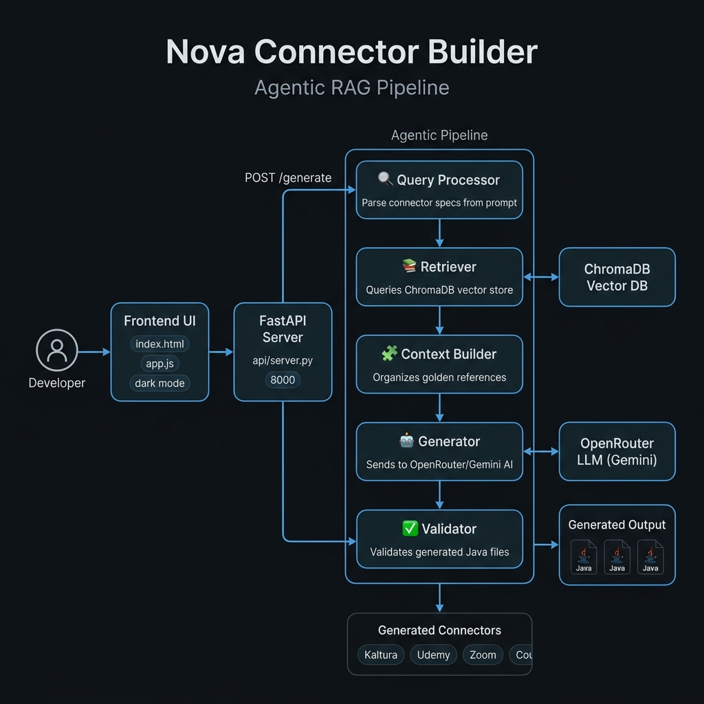
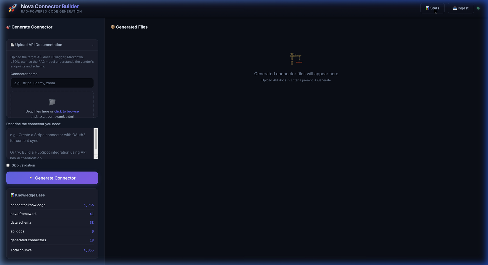
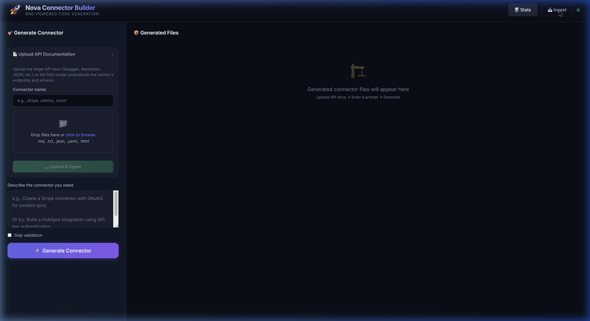

# 🤖 Nova Connector Builder

> **An Agentic RAG Pipeline that autonomously generates production-ready Java integration connectors for the Saba Nova LXP platform — powered by ChromaDB + OpenRouter (Gemini).**

---

## 🧠 What Is This?

Nova Connector Builder eliminates the need for engineers to manually write boilerplate Java code for every new third-party LMS/content integration. Instead, a developer simply types a natural language prompt like:

> *"Build a Udemy connector with OAuth2 and content catalog sync"*

...and the system autonomously:
1. **Understands** the connector requirements from the prompt
2. **Retrieves** the relevant golden reference implementations from a local vector database
3. **Generates** fully compliant Java files following the Saba Nova framework
4. **Validates** the output for correctness
5. **Injects** the code directly into the `sih_main` repository

**Connectors generated so far:** Kaltura · Udemy · Udacity · Zoom · Coursera · Stripe · SuccessFactors · Relly · HRMS · Business

---

## 🏗️ System Architecture



## 🖥️ Live UI Screenshots

| Main Interface | Knowledge Ingest Panel |
|---|---|
|  |  |

> The UI shows real-time knowledge base stats: **3,956 connector chunks · 41 Nova framework rules · 4,053 total chunks** in ChromaDB — all ready for RAG retrieval.

---

### The 5-Phase Agentic Pipeline

```
Developer Prompt
      │
      ▼
┌─────────────────────────────────────────────────────────┐
│                   FastAPI Server (port 8000)             │
│                      api/server.py                       │
└──────────────────────────┬──────────────────────────────┘
                           │  POST /generate
                           ▼
┌─────────────────────────────────────────────────────────┐
│                    pipeline.py (Orchestrator)            │
│                                                         │
│  Phase 1 ── 🔍 query_processor.py                       │
│             Parse: connector name, auth type, entities  │
│                           │                             │
│  Phase 2 ── 📚 retriever.py ◄──── ChromaDB Vector DB   │
│             Fetch: Golden refs + Framework rules        │
│                           │                             │
│  Phase 3 ── 🧩 context_builder.py                       │
│             Format, label (🏆 GOLDEN), truncate tokens  │
│                           │                             │
│  Phase 4 ── 🤖 generator.py ◄──── OpenRouter/Gemini AI │
│             Generate: Java + XML + SQL files            │
│                           │                             │
│  Phase 5 ── ✅ validator.py                              │
│             Check: mandatory methods, signatures        │
└──────────────────────────┬──────────────────────────────┘
                           │
                           ▼
                  Generated Connector Files
     ComponentControl.java · TestConnection.java
     Constants.java · Flows.java · Content.js
     VendorConstants_patch.java · dml_patch.sql
     *_edcast_content.xml
```

---

## 📁 Project Structure

```
nova_connector_builder/
│
├── api/
│   └── server.py               # FastAPI server — serves frontend + API routes
│
├── agent/                      # Core AI agent modules
│   ├── query_processor.py      # Parses natural language prompts into specs
│   ├── retriever.py            # Queries ChromaDB for relevant context
│   ├── context_builder.py      # Formats + organizes retrieved chunks
│   ├── prompt_templates.py     # System prompt templates for LLM
│   ├── generator.py            # LLM interaction via OpenRouter (Gemini)
│   ├── validator.py            # Post-generation validation checks
│   ├── repo_integrator.py      # Injects generated code into sih_main repo
│   └── feedback.py             # Feedback loop for iterative improvements
│
├── frontend/                   # Dark-mode web UI (vanilla HTML/CSS/JS)
│   ├── index.html              # Main UI shell
│   ├── index.css               # Sleek dark theme styles
│   └── app.js                  # UI logic — sends prompts, renders results
│
├── ingest/                     # Knowledge base ingestion pipeline
│   ├── ingest_connectors.py    # Ingests golden connector implementations
│   ├── ingest_api_docs.py      # Ingests third-party API documentation
│   ├── ingest_framework.py     # Ingests Nova framework rules
│   └── chunker.py              # Text chunking strategies
│
├── vectordb/
│   └── store.py                # ChromaDB vector store management
│
├── embeddings/
│   └── embedder.py             # Sentence-transformer embedding model
│
├── knowledge/
│   ├── framework_rules.md      # Nova framework compliance rules
│   ├── golden/                 # Hand-verified golden reference connectors
│   │   ├── kaltura/            # Kaltura — the primary golden standard
│   │   ├── linkedin_learning/
│   │   └── udemy/
│   ├── api_docs/               # Third-party API documentation
│   └── nova_docs/              # Saba Nova platform documentation
│
├── generated/                  # All AI-generated connector outputs
│   ├── kaltura/
│   ├── udemy/
│   ├── udacity/
│   ├── zoom/
│   ├── coursera/
│   ├── stripe/
│   ├── successfactor/
│   └── ...
│
├── pipeline.py                 # Main orchestration entry point
├── app.py                      # Alternate app entry point
├── requirements.txt            # Python dependencies
│
├── ARCHITECTURE_PRESENTATION.md
├── BOOTUP_WALKTHROUGH.md
├── QUICK_START.md
└── STARTUP_GUIDE.md
```

---

## ⚙️ Tech Stack

| Layer | Technology |
|-------|-----------|
| **Language** | Python 3.10+ |
| **API Framework** | FastAPI + Uvicorn |
| **Vector Database** | ChromaDB (local, persistent) |
| **Embedding Model** | `sentence-transformers` (all-MiniLM-L6-v2) |
| **LLM** | OpenRouter → `google/gemini-2.0-flash-001` |
| **LLM Orchestration** | LangChain + LangChain-Community |
| **Token Counting** | tiktoken |
| **Frontend** | Vanilla HTML + CSS + JS (dark mode) |
| **CLI** | Click + Rich |
| **Testing** | pytest |

---

## 🚀 Quick Start

### Prerequisites

- Python 3.10+
- An **OpenRouter API key** → [https://openrouter.ai](https://openrouter.ai)

### 1. Clone & Install

```bash
git clone https://github.com/ABHISHEK22029/nova-connector-builder.git
cd nova-connector-builder

python3 -m venv venv
source venv/bin/activate        # Mac/Linux
# OR: venv\Scripts\activate     # Windows

pip install -r requirements.txt
```

### 2. Configure API Key

Create a `.env` file in the root:

```env
OPENROUTER_API_KEY=sk-or-v1-your-key-here
```

### 3. Ingest Knowledge Base (first time only)

```bash
python3 -m ingest.ingest_connectors
python3 -m ingest.ingest_framework
python3 -m ingest.ingest_api_docs
```

### 4. Start the Server

```bash
python3 api/server.py
```

Open your browser → **http://localhost:8000**

### 5. Generate a Connector

Type in the UI:
```
Build a Udemy connector with OAuth2 authentication and content catalog sync
```

Hit **Generate** — the system will produce all required files within seconds.

---

## 📦 Generated Output (per connector)

Each connector generation produces:

| File | Purpose |
|------|---------|
| `{Name}ComponentControl.java` | Main connector orchestration class |
| `{Name}TestConnection.java` | Connection verification logic |
| `{Name}Constants.java` | Connector-specific constants |
| `{Name}Flows.java` | Sync flow definitions |
| `Content.js` | Frontend content mapping |
| `DefaultMappingConfig_patch.java` | Field mapping configuration |
| `VendorConstants_patch.java` | Patch for global vendor registry |
| `dml_patch.sql` | Database migration script |
| `{name}_edcast_content.xml` | ECL content configuration |

---

## 🗃️ Connectors Generated

| Connector | Auth Type | Entities Synced |
|-----------|-----------|-----------------|
| **Kaltura** *(Golden Reference)* | KS Token | Content Catalog |
| **Udemy** | OAuth2 | Courses, Subscriptions |
| **Udacity** | API Key | Nanodegrees, Content |
| **Zoom** | JWT/OAuth2 | Webinars, Recordings |
| **Coursera** | OAuth2 | Courses, Certificates |
| **SuccessFactors** | SAML/OAuth | Learning Activities |
| **Stripe** | API Key | Subscription Events |
| **HRMS** | Custom | User Sync |
| **Relly** | API Key | Content Catalog |

---

## 🧬 How the RAG Pipeline Works

```
1. Developer types: "Build a Zoom connector"
         │
2. query_processor.py extracts:
   { connector: "Zoom", auth: "JWT", entities: ["Webinars"] }
         │
3. retriever.py queries ChromaDB:
   → Fetches Kaltura golden files (🏆 highest priority)
   → Fetches Nova framework rules
   → Fetches Zoom API docs (if ingested)
   → Returns ~4,000 token chunks
         │
4. context_builder.py formats context:
   → Labels chunks: "🏆 GOLDEN REFERENCE", "📋 FRAMEWORK RULE"
   → Truncates to stay within 12,000 token LLM limit
         │
5. generator.py calls OpenRouter (Gemini):
   → Sends: system prompt + context + user requirement
   → Streams back: all Java/XML/SQL files in Markdown
         │
6. validator.py checks:
   → Does testEdcast() method exist? ✅
   → Does pagination router exist in Content.js? ✅
   → Are mandatory imports present? ✅
         │
7. Output displayed in UI with syntax highlighting
8. Optional: "Apply to Codebase" injects files into sih_main repo
```

---

## 📖 Additional Documentation

| Document | Description |
|----------|-------------|
| [`ARCHITECTURE_PRESENTATION.md`](ARCHITECTURE_PRESENTATION.md) | Deep-dive into the full execution flow |
| [`BOOTUP_WALKTHROUGH.md`](BOOTUP_WALKTHROUGH.md) | Step-by-step server startup guide |
| [`QUICK_START.md`](QUICK_START.md) | 5-minute quick start |
| [`STARTUP_GUIDE.md`](STARTUP_GUIDE.md) | Full environment setup guide |

---

## 📥 Portable ZIP

A complete zip of this project (excluding `venv/` and `chroma_db/`) is available in [`nova_connector_builder_COMPLETE.zip`](nova_connector_builder_COMPLETE.zip).

> **Note:** After unzipping, run `pip install -r requirements.txt` and re-ingest the knowledge base to rebuild the ChromaDB vector store locally.

---

## 👤 Author

**Abhishek Gupta** — Built as part of the Saba/SIH Nova connector integration project.

*May 2026*
